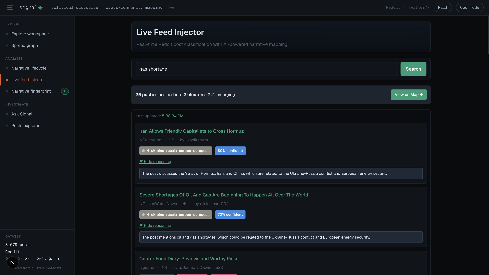
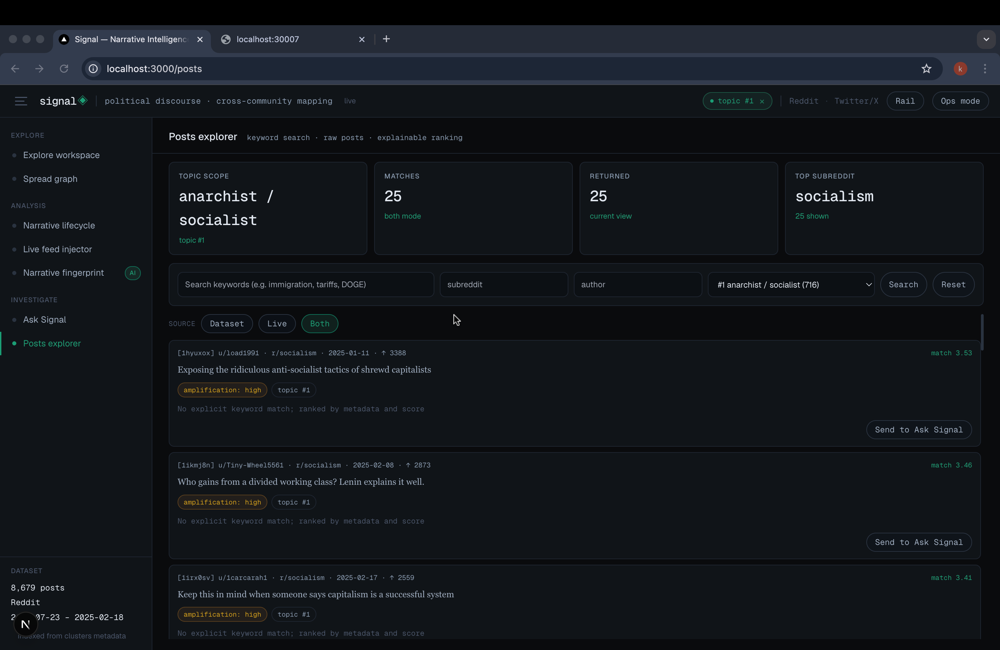
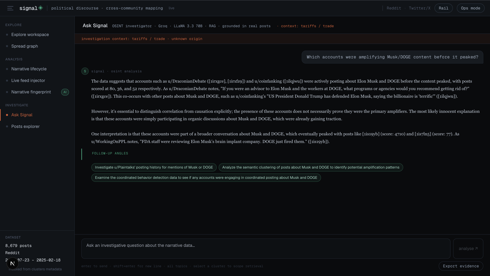

# Signal

Signal is an integrated narrative intelligence platform for investigating how online narratives emerge, spread, and mutate across communities.

It combines:

- Multi-view visual analytics
- Real-time Reddit live feed injection and classification
- Evidence-grounded analyst chat
- Cross-view topic scoping and investigation context

## Submission Requirements

This section is intentionally formatted to match the assignment checklist.

### 1. Publicly accessible hosted web platform URL

- Hosted URL: https://simppl-signal.vercel.app/explore

### 2. Detailed README with screenshots

Screenshots of key views:






### 3. Text-based system design explanation and thought process

Signal was designed as an investigation workflow, not a set of disconnected charts. The core design decision was to keep one shared cross-view context (active topic + investigation context) and let every view contribute evidence for the same narrative thread.

System design choices:

- Frontend architecture:
	- Next.js App Router with route-level pages for each investigation view.
	- Components are optimized for visual analysis (map, graph, stance, timeline, live feed cards).
- State model:
	- Zustand provides shared topic scope and investigation context across views.
	- Persistence is used for continuity (cross-page navigation and live feed restoration).
- API design:
	- Route handlers under `app/api` expose precomputed artifacts and live operations.
	- APIs are narrowly scoped (clusters, graph, stance, origins, chat, posts search, live inject, reports).
- Data strategy:
	- Heavy analytics are precomputed in the Python pipeline and exported as artifacts.
	- Runtime APIs stay responsive by reading generated JSON/meta files.
- Chat strategy:
	- Retrieval context is assembled from indexed metadata, then injected into a strict analyst system prompt.
	- A FAISS-backed retrieval index (with serverless-safe metadata export) is used for semantic evidence lookup.
	- Response post-processing surfaces follow-up actions and risk flags in UI.
- Live integration strategy:
	- Live Reddit results are classified into existing clusters and merged into posts explorer.
	- This bridges historical corpus analysis with real-time narrative monitoring.

Thought process behind trade-offs:

- Prioritized investigation speed and cross-view continuity over highly complex backend orchestration.
- Chose explainable UI elements (why matched, confidence, origin/velocity cues) over opaque aggregate scores.
- Kept model usage modular so model IDs and live classification behavior can be updated without redesigning the UI.

### 4. Video walkthrough link (YouTube or Google Drive)

- Video URL: https://youtu.be/5VJBWAujIt4

### 5. AI prompt log used during development

- Detailed first-person prompt log: `prompt.md`
- Extended prompt archive: `prompts.md`

### 6. Requirements Checklist (Implemented)

- Hosted web platform is public and accessible.
- Video walkthrough link is included.
- Multi-view investigative workflow is integrated end-to-end.
- Real-time Reddit ingestion and classification is implemented.
- Evidence-grounded chat workflow is implemented.
- Cross-view topic scoping and investigation continuity is implemented.
- Narrative lifecycle view now includes sentiment + toxicity phases.
- Legacy lifecycle analysis remains available for evaluator comparison.

### Evaluation helper note

For reviewers, the fastest path to evaluate the integrated flow is:

1. Open `/explore` and scope a topic.
2. Open `/analysis/livefeed` and classify live query results.
3. Open `/posts` and switch between Dataset/Live/Both.
4. Send a post to `/chat` using "Send to Ask Signal".
5. Verify follow-up chips and analyst alert behavior in Ask Signal.

## Product Overview

Signal is organized around a complete investigation workflow:

1. Discover narratives and active clusters
2. Inspect lifecycle, spread, stance, and coordination signals
3. Ingest live Reddit posts and classify into narrative clusters
4. Investigate raw posts with explainable matching
5. Send evidence to Ask Signal for analyst-style synthesis

## Recent Updates (March 2026)

- Ask Signal retrieval upgraded to semantic-expanded scoring over `data/faiss_meta.json` (serverless-safe FAISS metadata search).
- Ask Signal request handling now validates empty/very-short queries and adds non-English detection with same-language responses.
- Ask Signal responses now link post IDs like `[1ipgoly]` to `/posts?highlight=<id>` for direct evidence jumps.
- Posts explorer now supports URL-based highlighting (`/posts?highlight=<post_id>`) with auto-scroll and temporary visual emphasis.
- Timeline insight text moved from static copy to live model summaries via `/api/summary`.
- Timeline page and Explore timeline tab now include generated summaries plus on-demand detailed summary generation.
- Explore workspace now supports dynamic cluster count (`/api/clusters?k=<n>`) and cluster-aware filtering for trends/origins.
- Explore includes interactive UMAP scatter with topic scoping and click-to-scope interactions.
- Client state now includes persisted monitor query/alert primitives for scheduled monitoring workflows.
- Monitor agent panel is now visible in the Analyst Workflow right rail across pages.

## Feature Coverage

- Explore workspace with narrative map + context rails.
- Spread graph for account/community propagation topology.
- Live feed injector with Reddit fetch + cluster assignment.
- Posts explorer with Dataset / Live / Both modes.
- Ask Signal with retrieval grounding, follow-up chips, and analyst alerts.
- Analyst Workflow rail with monitor controls, tracked queries, and delta alert cards.
- Narrative lifecycle (new): sentiment arc + toxicity gradient + phase cards.
- Narrative lifecycle (legacy): origin/acceleration/amplification/mutation analysis.
- Fingerprint simulation across community archetypes.
- Coordination behavior view with pair-level evidence.
- Report/evidence export APIs for analyst workflows.

## Detailed Feature Descriptions

### 1. Explore Workspace (`/explore`)

- Purpose: serves as the investigation command center where analysts select a topic and keep a shared narrative context.
- What it provides:
	- Topic-level orientation with supporting trend/context panels.
	- Cluster count control with API-backed refetch (`k` parameter).
	- Interactive UMAP scatter for post-level cluster geometry and topic scoping.
	- A shared scope that propagates to downstream views (lifecycle, posts, chat, live feed).
	- Quick pivoting into deeper analysis routes without losing investigation state.
- Analyst value: reduces context switching by maintaining one continuous thread from discovery to evidence review.

### 2. Spread Graph (`/graph`)

- Purpose: visualize propagation structure across accounts/communities.
- What it provides:
	- Node-link network view of narrative spread paths.
	- Structural clues for amplification centers and bridge nodes.
	- Interactive exploration to inspect local neighborhoods around key actors.
- Analyst value: helps identify where narratives intensify and how they move between communities.

### 3. Globe View (`/globe`)

- Purpose: add geospatial context to narrative activity.
- What it provides:
	- Geographic distribution patterns tied to narrative events.
	- Regional concentration cues and location-linked signal surfacing.
- Analyst value: supports region-aware interpretation for narratives with geographic relevance.

### 4. Lifecycle Analysis (New) (`/lifecycle`)

- Purpose: quantify narrative evolution with sentiment and toxicity over lifecycle phases.
- What it provides:
	- Sentiment breakdown (positive/neutral/negative) across phase windows.
	- Toxicity gradients with interpretable severity bands.
	- Phase cards to summarize emergence, growth, and transition dynamics.
	- Fallback handling when scoped topics are sparse, so analysts still see meaningful context.
- Analyst value: makes narrative maturity and risk progression explicit with phase-level evidence.

### 5. Lifecycle Analysis (Legacy) (`/analysis/lifecycle`)

- Purpose: preserve the prior lifecycle framing for evaluator comparison and continuity.
- What it provides:
	- Origin -> acceleration -> amplification -> mutation stage interpretation.
	- Comparative reference against the new sentiment/toxicity lifecycle implementation.
- Analyst value: supports side-by-side methodological validation and reviewer transparency.

### 6. Live Feed Injector (`/analysis/livefeed`)

- Purpose: pull real-time Reddit posts and classify them into known narrative clusters.
- What it provides:
	- Query-driven live ingestion from Reddit.
	- On-the-fly topic assignment into existing cluster taxonomy.
	- Result persistence/restore behavior for iterative live monitoring sessions.
- Analyst value: connects historical model context with current platform activity.

### 7. Stance View (`/stance`)

- Purpose: track how positions shift over time around narratives.
- What it provides:
	- Stance streams and trend direction cues.
	- Temporal perspective on polarization and movement between positions.
- Analyst value: distinguishes growth in volume from actual opinion movement.

### 8. Signals / Coordination View (`/signals`)

- Purpose: surface potentially coordinated behavior patterns.
- What it provides:
	- Pair- or group-level coordination evidence.
	- Risk-oriented indicators for synchronized activity.
	- Integration with analyst alerting used by Ask Signal.
- Analyst value: highlights likely organized amplification rather than organic discussion.

### 9. Fingerprint View (`/fingerprint`)

- Purpose: characterize narrative style/archetype signatures.
- What it provides:
	- Archetype simulation and comparison outputs.
	- Similarity framing to relate active narratives to known behavioral patterns.
- Analyst value: accelerates pattern recognition across repeated campaign styles.

### 10. Posts Explorer (`/posts`)

- Purpose: inspect post-level evidence with explainable matching.
- What it provides:
	- Three source modes: Dataset, Live, and Both.
	- Interleaved comparison between historical and newly ingested live posts.
	- Explainability cues such as match reasons and confidence context.
	- Deep-link highlight mode via `?highlight=<post_id>` with smooth scroll to matching evidence card.
	- Per-post handoff to Ask Signal using prefilled evidence prompts.
- Analyst value: provides traceable evidence review before synthesis decisions.

### 11. Ask Signal (`/chat`)

- Purpose: generate analyst-style synthesis grounded in retrieved evidence.
- What it provides:
	- Retrieval-grounded answers constrained by semantic evidence from `faiss_meta.json`.
	- Topic-aware prompting when a scoped narrative is active.
	- Input validation for empty/under-specified queries.
	- Non-English query handling with same-language response behavior.
	- Follow-up question chips to continue investigation quickly.
	- Analyst alerts when risk patterns (coordination/velocity style cues) are present.
	- Clickable post-ID evidence links that jump directly to highlighted cards in `/posts`.
- Analyst value: turns scattered evidence into concise hypotheses and next-step questions.

### 12. Benchmark / Evaluation (`/benchmark`)

- Purpose: provide a controlled page for quality checks and comparisons.
- What it provides:
	- Evaluation-focused context for validating outputs.
	- A repeatable place to inspect behavior during testing or demos.
- Analyst value: supports reproducibility and reviewer confidence.

### 13. Analyst Workflow Rail (global right sidebar)

- Purpose: provide always-available analyst tooling while navigating any page.
- What it provides:
	- Weekly brief and active alert snapshots.
	- Monitor agent controls (on/off + interval chips).
	- Saved monitor queries scoped to active topic at creation time.
	- Delta alert cards with post previews and one-click jump to highlighted post evidence.
- Analyst value: keeps monitoring and triage in view without leaving the current analysis page.

### 14. Legacy Direct Views (`/map`, `/timeline`, `/trends`, `/origins`)

- Purpose: keep direct access to specialized analysis pages used in earlier flows.
- What they provide:
	- Map-level and timeline-level direct inspection.
	- Trend and origin focused decomposition outside the unified workspace.
- Analyst value: allows targeted deep-dives when a single lens is preferred over multi-panel workflows.

### 15. Report and Evidence APIs (`/api/report/evidence`, `/api/report/weekly-brief`)

- Purpose: export investigation artifacts for analyst reporting.
- What they provide:
	- Evidence packaging for downstream reporting workflows.
	- Brief generation scaffolding for recurring monitoring summaries.
- Analyst value: shortens handoff from analysis to written intelligence outputs.

## Main Routes

### Explore

- `/explore` - unified workspace (map, trends, origins, timeline paneling)
- `/graph` - spread network graph
- `/globe` - geospatial event context

### Analysis

- `/lifecycle` - narrative lifecycle (sentiment arc + toxicity gradient + phase detection)
- `/analysis/lifecycle` - legacy lifecycle (origin → acceleration → amplification → mutation)
- `/analysis/livefeed` - live Reddit post injector and classifier
- `/stance` - stance river and stance shifts over time
- `/signals` - coordinated behavior and related risk views
- `/fingerprint` - narrative fingerprint and similarity view

### Investigate

- `/chat` - Ask Signal (streaming investigative assistant)
- `/posts` - posts explorer (dataset/live/both modes)
- `/benchmark` - benchmark and evaluation page

### Legacy/Direct Views (still present)

- `/map`, `/timeline`, `/trends`, `/origins`

## Integrated Features

### Cross-view scoped investigations

- Shared Zustand state for active topic and investigation context
- Topic scope flows from explore/analysis into chat and posts explorer

### Monitor agent workflow

- Global right rail includes the Monitor panel on all pages rendered within Shell.
- Monitor can be toggled on/off with 5/15/30 minute intervals.
- Analysts can save scoped queries and receive delta alerts from `/api/live/inject` polling.
- Alert previews link directly to `/posts?highlight=<post_id>` for rapid evidence review.

### Ask Signal enhancements

- Semantic-expanded retrieval grounded in `data/faiss_meta.json`
- Analyst alert injection for coordination/velocity signals
- Follow-up question generation (rendered as clickable chips)
- Context-aware scoped prompts
- Input validation for empty/too-short prompts
- Same-language response behavior for non-English queries
- Clickable post-ID links to highlighted post evidence cards

### Semantic retrieval zero-overlap checks

These checks validate semantic expansion retrieval over data/faiss_meta.json even when exact keywords differ:

1. Query: "rage and hostility online" -> retrieves toxic DOGE/immigration style posts.
2. Query: "information warfare tactics" -> retrieves coordinated behavior style posts.
3. Query: "economic anxiety" -> retrieves tariff/trade/federal worker style posts.

### Live feed + posts explorer integration

- Live feed stores classified posts in app state
- Posts explorer supports source modes:
	- Dataset
	- Live
	- Both (interleaved with live marker)
- Per-post action to send evidence to Ask Signal with prefilled prompt

### Persistence behavior

- Core app state persisted with Zustand
- Live feed query/results cached in session storage and restored on return
- Background refresh runs when returning to live feed with a prior query

## Tech Stack

- Next.js App Router (TypeScript, React)
- Zustand for client state and persistence
- Vercel AI SDK + Groq for chat/inference
- FAISS (via exported metadata index) for semantic retrieval grounding
- Pixi.js, D3, and react-force-graph-2d for visuals
- Python pipeline scripts for artifact generation

## API Surface

Implemented API routes include:

- `/api/account/[id]`
- `/api/alerts`
- `/api/chat`
- `/api/clusters`
- `/api/coord`
- `/api/counterfactual`
- `/api/fingerprint`
- `/api/globe`
- `/api/graph`
- `/api/live/inject`
- `/api/narrative-diff`
- `/api/origins`
- `/api/posts/search`
- `/api/report/evidence`
- `/api/report/weekly-brief`
- `/api/summary`
- `/api/stance`
- `/api/trends`
- `/api/umap`
- `/api/velocity`

Notable API behavior updates:

- `/api/clusters` supports optional `k` query parameter for top-N cluster payloads.
- `/api/summary` generates model-based narrative summaries for timeline context blocks.
- `/api/chat` returns analyst/risk headers plus non-English detection header when applicable.

## Data Artifacts

Expected data artifacts for full functionality:

- `public/data/topics.json`
- `public/data/umap_points.json`
- `public/data/velocity.json`
- `public/data/stance_series.json`
- `public/data/coord.json`
- `public/data/graph.json`
- `data/faiss_meta.json`

If artifacts are missing, routes may return publication-safe missing-data responses unless synthetic mode is enabled.

## Setup

### Prerequisites

- Node.js 20+
- Python 3.11+

### Install

```bash
npm install
pip install -r scripts/requirements.txt
```

### Environment

Create `.env.local`:

```dotenv
GROQ_API_KEY=your_key_here
```

Optional:

```dotenv
# Enable synthetic fallback behavior when artifacts are missing
SIGNAL_ALLOW_SYNTHETIC_DATA=true

# Optional override for live feed classifier model
GROQ_MODEL_LIVE_INJECT=llama-3.3-70b-versatile
```

### Run

```bash
npm run dev
```

### Build

```bash
npm run build
npm run start
```

## Pipeline

Run the full artifact pipeline:

```bash
bash scripts/run_pipeline.sh
```

Pipeline stages:

1. `01_load.py`
2. `02_embed.py`
3. `03_cluster.py`
4. `04_stance.py`
5. `05_coord.py`
6. `06_graph.py`
7. `07_index.py`
8. `08_export_json.py`
9. `09_validate.py`
10. `10_origins.py`
11. `11_narrative_diff.py`
12. `12_alerts.py`
13. `13_counterfactual.py`

## Developer Notes

- Use `/explore` as the default investigation entry point.
- Use `/analysis/livefeed` to ingest and classify real-time Reddit posts.
- Use `/posts` in Both mode to compare historical corpus posts with live classified posts.
- Use `/posts?highlight=<post_id>` to jump to and temporarily highlight evidence cards.
- Use Ask Signal for synthesis and follow-up investigative framing.

## Similar Platforms Studied
1. **NarrativeSignal** (fellow applicant) — network graph + 
   streamgraph approach. Strong visual design but relies on 
   synthetic/demo data. Signal differentiates with real pipeline 
   output and specific findings.
2. **Fabio Giglietto's TikTok CSBN** — coordinated behavior 
   visualization. Inspired our URL-pair synchronization detection.
3. **Integrity Institute Dashboard** — misinformation amplification 
   tracking. Inspired our "rage amplification" metric (toxic posts 
   get 2.4× more upvotes than civil posts).
4. **News Literacy Project** — source credibility focus. Signal 
   extends this by tracking not just sources but narrative mutation 
   across communities.
